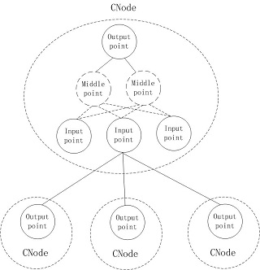

<h1 align="center">CNode</h1>

CNode contains multiple input points and one output point, all of which are of type CNodePoint. Each input point is connected to multiple other CNode nodes, and the output point is connected to all input points inside the CNode.

The output of CNode is output of the output point.



Define CNode Type and Create Instance
------

**1. define CNode type**

The CNode type is defined by the CNodeSet's DefineType function. CNode types are indexed by keywords.

When defining a type, specify the name of the type keyword and the name of an input node. If multiple input nodes are required, they are created by the CNode function CreateInputPoint. You can also create a new input node for a CNode's instance. When the CNodeSet processes Merge, the new input point will be combined to the CNode type.

```python
set.DefineNode('345234535235','',0,OutputPointClass)
set.CreateDefInput('345234535235',InputPointClass, 'in1', 0,False,False);

or 

set.DefineNodeEx('345234535235','',0)   
set.CreateDefInput('345234535235',InputPointClass, 'in1', 0,False,False);
```

**2. Create instance of CNode**

Do not create an instance of CNode directly, but create the instance through CNodeSet's CreateNode function.

Property of input point
------

These properties can only be set when the input point is created with CreateInputPoint/CreateDefInput. Can be obtained during operation, but cannot be modified

*[VS_BOOL IsNegative](#)*

Get via GetNegativeFlag / GetSourceNegativeFlag/GetDefInputNegativeFlag function.

NegativeFlag can be true or false, usually false, which means that when the point is activated, it supports the activation of the owning node. If it is true, when the point is activated, it opposes the activation of the owning node.

The NegativeFlag of output point is false.

*[VS_BOOL IsNotCondition](#)*

Get via GetConditionFlag / GetSourceConditionFlag/GetDefInputConditionFlag function.
If equal to true, the ConditionFlag is false, otherwise the ConditionFlag is equal to true.

If ConditionFlag is equal to False, then when calculating the output, it should not be taken into account, and the intermediate node of Node should not be connected to the node whose ConditionFlag is equal to False.

The ConditionFlag of output point is True.

*[VS_BOOL IsDynamic](#)*

Get via GetDynamicFlag / GetSourceConditionFlag/GetDefInputDynamicFlag function.
If equal to true, the DynamicFlag is true, otherwise the DynamicFlag is equal to false.

Indicates that the relationship is dynamic, temporary, and need not save

The DynamicFlag of output point is False.

**[If the node is deactivated, the connection between it acts as the source node to the input point which DynamicFlag is true will be disconnected](#)**

*[VS_INT32 MaxSlotNumber](#)*

0 means no limit, otherwise it is the maximum number of slots. 

If it is equal to 0, the input point can be dynamically expanded.

*[void *PatternClass](#)*

Get via GetPatternClass/GetDefInputPatternClass

PatternClass is used to record the relationship of source node of input point. 

Functions supported by CNodePoint
------

#### a.Key Value

*[SetParameter](#)*

Set the Parameter. The input value maybe bool, int, double, parapkg or string. If Value is NULL, then the parameter will be removed

`VS_BOOL SetParameter(VS_CHAR *Name, void *Value)`

*[GetParameter/Parameter](#)*

Get the Parameter. The return value maybe bool, int, double, parapkg or string

`void *GetParameter(VS_CHAR *Name)`

`VS_PARAPKGPTR Parameter()`

*[GetParameterKey](#)*

`VS_PARAPKGPTR GetParameterKey()`

#### b.Attach Object

AttachObject maybe any cle object.

*[GetAttachObject](#)*

`void *GetAttachObject()`

*[SetAttachObject](#)*

`void SetAttachObject(void *Object)`

#### c.Compare function

*[IsSame](#)*

`VS_BOOL IsSame(void *CNodePoint)`

Two Nodes have the same Key

*[Equals](#)*

`VS_BOOL Equals(void *CNodePoint)`

Two Nodes have the same Key, and parameters are equal.

#### d.Calculation-related functions

*[ExpectOutput](#)*

This function calls the ExpectOutput function of output point of the node. The result is list of sublayer node with target value, such as, [[source node 1, targetvalue1],[source node 2, targetvalue1],...]

`VS_PARAPKGPTR ExpectOutput(VS_DOUBLE TargetValue)`

TargetValue must be [0.0,1.0]

The output value of the node must be created.

*[IsActive](#)*

Node produces valid output with a value greater than CNODE_ACTIVE_MINVALUE(0.5)

`VS_BOOL IsActive()`

*[IsOutputValid](#)*

Whether the output of the node is valid

`VS_BOOL IsOutputValid()`

*[SetOutput](#)*

Set the output value of node manually. The node will force to deactive. ActiveNode/ActiveBatchNode of nodeset need be called to activate the node.

`void SetOutput(VS_DOUBLE OutputValue)`

*[GetOutput](#)*

If the output of Node is valid, the output value is returned; otherwise, the callback function OnExecute of the output NodePoint is called to calculate the output

`VS_DOUBLE GetOutput()`

*[ClearOutput](#)*

Clear output, setting output is invalid.  The function returns self and can be used for cascading

`void *ClearOutput()`

*[GetOutputTick](#)*

Get the Tick that produced the output

`VS_INT64 GetOutputTick()`

#### d1.ActionOutput

The action node may dynamically establish a connection in the OnExecute callback. The following function is used to obtain the target node dynamically connected as action output, or clear the dynamic connection.

*[SetActionOutput](#)*

`VS_BOOL SetActionOutput(void *CNodePointClass, void *SourceNodeOrParaPkg, ...)`

SourceNodeOrParaPkg maybe a parapkg or multiple nodes.

*[GetActionOutput](#)*

`VS_PARAPKGPTR GetActionOutput()`

*[ClearActionOutput](#)*

`void ClearActionOutput()`

#### e.Connection related functions

*[IsTarget](#)*

NodePoint's Key is already the target node of this Node

`VS_BOOL IsTarget(void *TargetNodePoint)`

*[IsTargetNode](#)*

Input node has at least one NodePoint's Key is already the target node of this Node

`VS_BOOL IsTargetNode(void *TargetNode)`

*[CanAsTarget/CanAsTargetNode](#)*

If MustHasEmptySlot true, the TargetNode must has empty target slot.

`VS_BOOL CanAsTarget(void *TargetNodePoint,VS_BOOL MustHasEmptySlot)`

`VS_BOOL CanAsTargetNode(void *TargetNode, VS_CHAR *TargetNodePointKey, VS_BOOL MustHasEmptySlot)`

*[CanAsTargetNodeEx](#)*

If success, return the key of input point.

`VS_CHAR *CanAsTargetNodeEx(void *TargetNode, VS_BOOL MustHasEmptySlot)`

*[IsTargetConnect/IsTargetNodeConnect](#)*

NodePoint is already conected to this Node as target node point

`VS_BOOL IsTargetConnect(void *TargetNodePoint, VS_CHAR *SlotID)`

`VS_BOOL IsTargetNodeConnect(void *TargetNode, VS_CHAR *TargetNodePointKey, VS_CHAR *SlotID)`

SlotID maybe NULL or empty string.

*[IsTargetNodeConnectEx](#)*

Input node has at least one NodePoint conected to this Node as target node point

`VS_BOOL IsTargetNodeConnectEx(void *TargetNode)`

*[GetSlotIDByTarget/GetSlotIDByTargetNode](#)*

maybe 0, 1, or mulitiple.

`VS_PARAPKGPTR GetSlotIDByTarget(void *TargetNodePoint)`

`VS_PARAPKGPTR GetSlotIDByTargetNode(void *TargetNode, VS_CHAR *TargetNodePointKey)`

*[AllocSlotID/AllocSlotIDNode](#)*

This function first finds the existing SlotID which is not connected, and is not in ExcudeSlotID, if not, assigns a new ID.

`VS_CHAR *AllocSlotID(void *TargetNodePoint, VS_PARAPKGPTR ExcudeSlotID)`

`VS_CHAR *AllocSlotIDNode(void *TargetNode, VS_CHAR TargetNodePointKey, VS_PARAPKGPTR ExcudeSlotID)`

*[ConnectTarget/ConnectTargetNode](#)*

Connect this Node to the input point of the target Node. 

**[SlotID maybe NULL or empty string. In this case,if the NodePoint is already connected to other nodes and has no empty slots, this function will disconnect the current connection for new.To avoid this situation, you can use the DisConnect function to release the slot first.](#)**

If SlotID does not exist, new source point will be added for input point of the target Node.

`VS_BOOL ConnectTarget(void *TargetNodePoint, VS_CHAR *SlotID)`

`VS_BOOL ConnectTargetNode(void *TargetNode, VS_CHAR *TargetNodePointKey, VS_CHAR *SlotID)`

*[DisConnectTarget/DisConnectTargetNode](#)*

Delete the connection to the target node

`void DisConnectTarget(void *TargetNodePoint, VS_CHAR *SlotID)`

`void DisConnectTargetNode(void *TargetNode, VS_CHAR *TargetNodePointKey, VS_CHAR *SlotID)`

SlotID may be NULL or empty string.

*[RemoveTarget/RemoveTargetNode](#)*

Delete the target node relation.

`void RemoveTarget(void *TargetNodePoint)`

void RemoveTargetNode(void *TargetNode, VS_CHAR *TargetNodePointKey)`

*[GetTargetKey](#)*

Get the Key list of the Node and NodePoint which the target may connect to.

The format is :
[ [CNodeKey,NodePointKey],[CNodeKey,NodePointKey],...]

`VS_PARAPKGPTR GetTargetKey()`

*[GetTarget](#)*

Get the list of target NodePoint connected.

`VS_PARAPKGPTR GetTarget()`

*[GetTargetNode](#)*

Get the list of target node.

`VS_PARAPKGPTR GetTargetNode()`

*[GetTargetNodeEx](#)*

Get the list of target node dynamically connected.

`VS_PARAPKGPTR GetTargetNodeEx()`

*[GetTargetNodeKey](#)*

Get the list of target node keys.

`VS_PARAPKGPTR GetTargetNodeKey()`

#### f.input and output point functions

*[CreateOutputPoint](#)*

Delete the current output node and create a new output node

`void *CreateOutputPoint(void *CNodePointClass)`

*[GetOutputPoint](#)*

`void *GetOutputPoint()`

*[GetOutputClass](#)*

`void *GetOutputClass()`

*[CreateInputPoint](#)*

If it already exists, and the parameters are the same, it returns success, otherwise it displays a warning message and returns NULL.

`void *CreateInputPoint(void *CNodePointClass,VS_CHAR *InputPointKey,VS_INT32 MaxSlotNumber,VS_BOOL IsNegative, VS_BOOL IsNotCondition, VS_BOOL IsDynamic)`

MaxSlotNumber = 0 means no limit

**[If IsNegative is true, the node should be inactive when the input point is activated](#)**

**[If IsNotCondition is true, the input node point's ConditionFlag will be set to false, then when calculating the output, it should not be taken into account, and the intermediate node of Node should not be connected to it.](#)**

**[If IsDynamic is equal to True, then input point need not save or merge. It's connections are valid for itself](#)**

**[InputPointKey maybe NULL or empty string](#)**

*[RemoveInputPoint](#)*

`void RemoveInputPoint(VS_CHAR *CNodePointKey)`

*[FindInputPoint/FindInputPointEx](#)*

`void *FindInputPoint(VS_CHAR *CNodePointKey)`

`VS_PARAPKGPTR FindInputPointEx(void *CNodePointClass)`

*[AllocInputPoint](#)*

The input to which the source node can be connected, the input has empty slots, or the number of slots is not limited, or the maximum number of slots is not reached.

`VS_PARAPKGPTR AllocInputPoint(void *SourceNode, VS_BOOL IsNegative, VS_BOOL IsNotCondition, VS_BOOL IsDynamic)`

*[GetInputMaxSlotNumber](#)*

`VS_INT32 GetInputMaxSlotNumber(VS_CHAR *CNodePointKey)`

*[GetInputNegativeFlag](#)*

`VS_BOOL GetInputNegativeFlag(VS_CHAR *CNodePointKey)`

*[GetInputConditionFlag](#)*

`VS_BOOL GetInputConditionFlag(void *CNodePoint)`

*[GetInputDynamicFlag](#)*

`VS_BOOL GetInputDynamicFlag(void *CNodePoint)`

*[GetInputPoint/GetInputPointEx](#)*

Get the list of input points

`VS_PARAPKGPTR GetInputPoint()`

`VS_PARAPKGPTR GetInputPointEx(VS_BOOL ConditionFlag,VS_BOOL DynamicFlag)`

*[GetInputPointKey/GetInputPointKeyEx](#)*

Get the list of input point keys

`VS_PARAPKGPTR GetInputPointKey()`

`VS_PARAPKGPTR GetInputPointKeyEx(VS_BOOL ConditionFlag, VS_BOOL DynamicFlag)`

*[GetActiveInput/GetActiveInputEx](#)*

Get the list of input points which output is valid and active(larger than threshold)

`VS_PARAPKGPTR GetActiveInput()`

`VS_PARAPKGPTR GetActiveInputEx(VS_BOOL ConditionFlag, VS_BOOL DynamicFlag)`

*[GetActiveInputKey/GetActiveInputKeyEx](#)*

Get the list of input point keys which output is valid and active(larger than threshold)

`VS_PARAPKGPTR GetActiveInputKey()`

`VS_PARAPKGPTR GetActiveInputKeyEx(VS_BOOL ConditionFlag, VS_BOOL DynamicFlag)`

*[GetSourceNode/GetSourceActiveNode](#)*

Get the list of source nodes. If InputPointKey is not NULL, return the source node connected corresponding to the input point, and NULL for slot not connected. 

If InputPointKey is NULL, return all source nodes connected, does not contain duplicate nodes

`VS_PARAPKGPTR GetSourceNode(VS_CHAR *InputPointKey)`

`VS_PARAPKGPTR GetSourceActiveNode(VS_CHAR *InputPointKey))`

*[GetSourceNodeKey](#)*

Get the list of source node's keys. If InputPointKey is not NULL, return the source node keys of each slot. The number of items returned is the same as the number of slots, if the corresponding slot is not connected to the source node, it is set to NULL

If InputPointKey is NULL, return all source nodes keys, does not contain duplicate node keys

`VS_PARAPKGPTR GetSourceNodeKey(VS_CHAR *InputPointKey))`

*[IsSourceNodeConnect](#)*

`VS_BOOL IsSourceNodeConnect(void *CSourceNode)`

*[CopySourceNode/CopySourceNodeEx](#)*

Copy the connected source nodes and connect them to this node.

`VS_BOOL CopySourceNode(void *FromCNodePoint)`

`VS_BOOL CopySourceNodeEx(void *FromNode, VS_CHAR *InputPointKey)`

*[GetSlotID](#)*

`VS_PARAPKGPTR GetSlotID(VS_CHAR *InputPointKey)`

*[GetSlotNumber](#)*

`VS_INT32 GetSlotNumber(VS_CHAR *InputPointKey)`

*[GetSlotIDAt](#)*

`VS_CHAR *GetSlotIDAt(VS_CHAR *InputPointKey,VS_INT32 Index)`

*[GetSlotIDBy](#)*

Get the SlotID that the source node can connect to

`VS_PARAPKGPTR GetSlotIDBy(VS_CHAR *InputPointKey,VS_CHAR *SourceNodeKey)`

*[GetSlotIndex](#)*

`VS_INT32 GetSlotIndex(VS_CHAR *InputPointKey, VS_CHAR *SlotID)`

If the slot does not exist, it returns -1

*[GetSlotSourceNode](#)*

`void *GetSlotSourceNode(VS_CHAR *InputPointKey,VS_CHAR *SlotID)`

source node which the slot connect.

*[GetSlotSourceNodeKey](#)*

`VS_CHAR *GetSlotSourceNodeKey(VS_CHAR *InputPointKey,VS_CHAR *SlotID)`

source node key which the slot can connect.

*[HasSlotParameter](#)*

`VS_BOOL HasSlotParameter(VS_CHAR *InputPointKey,VS_CHAR *SlotID,VS_CHAR *ValueKey)`

*[GetSlotParameter/GetSlotParameterEx](#)*

`void *GetSlotParameter(VS_CHAR *InputPointKey, VS_CHAR *SlotID, VS_CHAR *ValueKey)`

`VS_PARAPKGPTR GetSlotParameterEx(VS_CHAR *InputPointKey,VS_PARAPKGPTR SlotIDList, VS_CHAR *ValueKey)·

The value may be int, double, bool, string or parapkg

*[SetSlotParameter/SetSlotParameterEx](#)*

`VS_BOOL SetSlotParameter(VS_CHAR *InputPointKey, VS_CHAR *SlotID, VS_CHAR *ValueKey, void *Value)`

`VS_BOOL SetSlotParameterEx(VS_CHAR *InputPointKey,VS_PARAPKGPTR SlotIDList, VS_CHAR *ValueKey, VS_PARAPKGPTR ValueList)`

The value may be int, double, bool, string or parapkg

*[RemoveSlotParameter/RemoveSlotParameterEx](#)*

`void RemoveSlotParameter(VS_CHAR *InputPointKey, VS_CHAR *SlotID, VS_CHAR *ValueKey)`

`void RemoveSlotParameterEx(VS_CHAR *InputPointKey,VS_PARAPKGPTR SlotIDList, VS_CHAR *ValueKey)`

*[GetSlotParameterKey](#)*

`VS_PARAPKGPTR GetSlotParameterKey(VS_CHAR *InputPointKey, VS_CHAR *SlotID)`

*[SlotParameter/SlotParameterEx](#)*

Get slot parameters

`VS_PARAPKGPTR SlotParameter(VS_CHAR *InputPointKey, VS_CHAR *SlotID)`

`VS_PARAPKGPTR SlotParameterEx(VS_CHAR *InputPointKey,VS_PARAPKGPTR SlotIDList)`

#### f.1.Bind Input point

The input point may be connected to a certain type of node. When the node is activated, it may determine the specific instance node of the type and connect the instance node to the node. This process is called input determination.

The agreement is as follows:

Create a dynamic type input point for the determined instance node, and set the Key value of the input point to the SlotID of the input point connected to the type node.

*[IsBindInput](#)*

This input is bind of other inputs

`VS_BOOL IsBindInput(VS_CHAR *InputPointKey)`

*[GetBindInput](#)*

This input is bind of which input

`void *GetBindInput(VS_CHAR *InputPointKey)`

*[GetBindInputEx](#)*

Get which input points are bind

`VS_PARAPKGPTR GetBindInputEx()`

*[GetBindSlot](#)*

Get which Slots of input points are bind

`VS_PARAPKGPTR GetBindSlot(VS_CHAR *InputPointKey)`

*[GetUnBindSlot](#)*

Get which Slots of input points are unbind

`VS_PARAPKGPTR GetUnBindSlot(VS_CHAR *InputPointKey)`

*[HasUnBindSlot](#)*

`VS_BOOL HasUnBindSlot(VS_CHAR *InputPointKey)`

*[SetBindSlot](#)*

Create Bind input point for slot if the input point does not exist, the input point's ConditionFlag is false, DynamicFlag is true.

`VS_BOOL SetBindSlot(void *CNodePointClass,VS_CHAR *InputPointKey, VS_CHAR *SlotID, void *SourceNodeOrParaPkg, ...)`

SourceNodeOrParaPkg may be a parapkg or multiple nodes.

*[IsBindSlot](#)*

The slot has beed bind or not.

`VS_BOOL IsBindSlot(VS_CHAR *InputPointKey,VS_CHAR *SlotID)`

*[ClearBindSlot](#)*

unconnect the bind source node, and remove the bind input point for slotid.

`VS_BOOL ClearBindSlot(VS_CHAR *InputPointKey, VS_CHAR *SlotID)`

*[ClearBindInput](#)*

unconnect the bind source node, and remove the bind input point for slots of input point

`VS_BOOL ClearBindInput(VS_CHAR *InputPointKey)`

*[GetBindSourceNode](#)*

Get bind slot source node

`VS_PARAPKGPTR GetBindSourceNode(VS_CHAR *InputPointKey,VS_CHAR *SlotID)`

If SlotID is null, returns the source node connected to each slot.

*[HasBindSourceNode](#)*

Is bind slot has connect source node

`VS_BOOL HasSlotBindSourceNode(VS_CHAR *InputPointKey, VS_CHAR *SlotID)`

#### f.2.Input point Pattern

*[CreatePattern](#)*

Return a new pattern. Only input points of node which dynamic flag is false can create a pattern

`void *CreatePattern(void *PatternClass)`

*[RemovePattern](#)*

`void RemovePattern(void *Pattern)`

*[GetPattern](#)*

`VS_PARAPKGPTR GetPattern()`

Pattern is used to record the relationship between source nodes

#### i.Other functions

*[GetReader](#)*

please refer to CNodeSet.md

`void *GetReader(void *NodeReaderClass)`

NodeReaderClass maybe NULL

#### j.Other functions

*[SetLabel](#)*

`void SetLabel(VS_CHAR *Label)`

*[GetLabel](#)*

`VS_CHAR *GetLabel()`

*[SetKey](#)*

Set the key of node. If Key is already set, do not modify it

`void SetKey(VS_CHAR *Key)`

*[GetKey](#)*

Get the key of node.

`VS_CHAR *GetKey()`

*[GetOwnerType](#)*

OwnerType is set when DefineNode, 0 and 1 are reserved, the meaning is interpreted externally

`VS_INT32 GetOwnerType()`

*[GetNodeSet](#)*

Get the Node Set to which the node belongs

`void *GetNodeSet()`

*[SaveToString](#)*

Save node to string in json format

`VS_CHAR *SaveToString()`

*[LoadFromString](#)*

Load node from json string. The node must be in a NodeSet

`VS_BOOL LoadFromString(VS_CHAR *SaveValue)`

*[LoadFromStringEx](#)*

Load node from json string, and return a new created node. This function can be called on any CNode object.

The CNodeSet is which new Node will be inserted to, and must not be NULL.

`void *LoadFromStringEx(void *CNodeSet,VS_CHAR *SaveValue)`

*[SetCallOnActive](#)*

CallableRawObject is callable cle object which may wrap a raw function.

If the node changes to active, CallableRawObject is called.

The CallableRawObject is setting dynamicly, and does not save to storage. And can be multiple

`void SetCallOnActive(void *CallableRawObject)`


*[EnableCallOnActive](#)*

`void EnableCallOnActive()`

*[DisableCallOnActive](#)*

`void DisableCallOnActive()`


