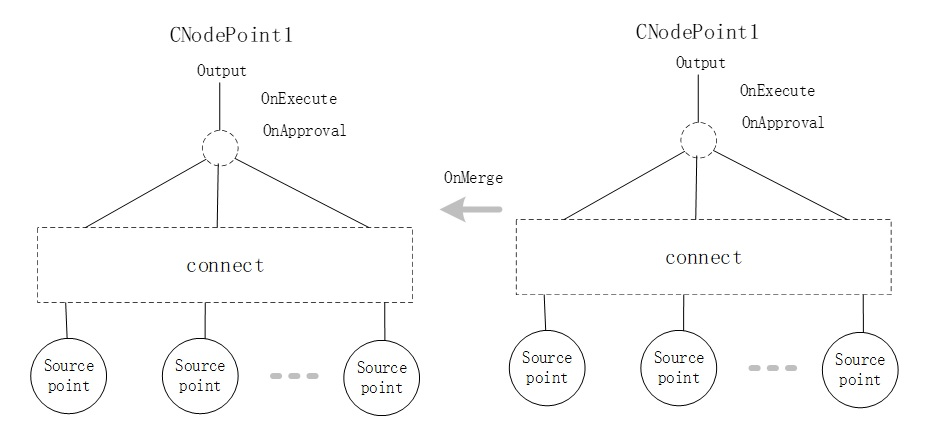
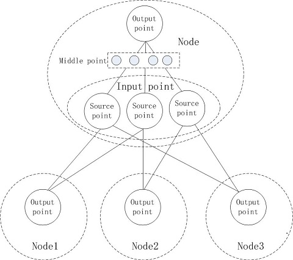

<h1 align="center">CNodePoint</h1>

CNodePoint is a connection point inside Node. It is a many-to-one connection network. The specific connection structure is defined externally. The connection-related parameters are stored in CNodePoint in json format.

CNodePoint is used to connect other Node nodes and is the input point of Node. It is used to connect multiple input points inside Node at the same time, which is the output point of Node.



Define CNodePoint Type and Create Instance
------

**1. define CNodePoint type**

```python
MyPointClass = Service.CNodePointBase('MyPointClass')
@MyPointClass._RegScriptProc_P('OnInit')
def OnInit(self) :
  #This callback function is called when NodePoint is created. Called when NodePoint is initialized. 
  return None

@MyPointClass._RegScriptProc_P('OnDispose')
def OnDispose(self) :
  #This callback function is called when NodePoint is released
  return None
    
@MyPointClass._RegScriptProc_P('OnExecute')
def OnExecute(self,CNodeSet,CNode) :
  node_output = self.GetSourceOutput()
  if len([t for t in node_output if t >= 0.5]) :
    return 1.0
  return 0.0
  
@MyPointClass._RegScriptProc_P('OnDoAction')
def OnDoAction(self,CNodeSet,CNode,Output) :
  return True  
  
'''
# The node can dynamically establish a connection in the OnDoAction callback via function SetActionOutput.
'''  
   
@MyPointClass._RegScriptProc_P('OnExpectOutput')
def OnExpectOutput(self,CNodeSet,CNode,TargetValue,Result) :  
  print('OnExpectOutput.......',str(TargetValue));
  ....
  return False 

@MyPointClass._RegScriptProc_P('OnMerge')
def OnMerge(self,SourcePointList) :  
  print('Merge.......');
  return False  
  
@MyPointClass._RegScriptProc_P('OnSave')
def OnSave(self,CNodeSet,CNode) :  
  print('OnSave.......');
  return False    
```

For CNodePoint, this callback functions may be defined: OnExecute,OnDoAction and OnExpectOutput. OnExecute is used to compute the output of this NodePoint. OnDoAction is used to perform action related with the NodePoint. OnExpectOutput gives target value to train the node point.

**2. Create instance of CNodePoint**

Do not create an instance of CNodePoint directly, but create the node's input point through CNode's CreateInputPoint, or CreateOutputPoint to create the node's output point.


Functions supported by CNodePoint
------

#### a.Compare function

*[IsSame](#)*

`VS_BOOL IsSame(void *CNodePoint)`

Two NodePoints have the same Key and are Child of the same Node

*[Equals](#)*

`VS_BOOL Equals(void *CNodePoint)`

Two NodePoints have the same Key and are Child of the same Node, and parameters are equal.

#### b.Attach Object

AttachObject maybe any cle object.

*[GetAttachObject](#)*

`void *GetAttachObject()`

*[SetAttachObject](#)*

`void SetAttachObject(void *Object)`

#### c.Inference related functions

*[GetB](#)*

**[B is stored in NodePoint and can be used to build a simple MP network](#)**

`VS_DOUBLE GetB()`

*[SetB](#)*

`void SetB(VS_DOUBLE B)`

*[IsActive](#)*

Node produces valid output with a value greater than CNODE_ACTIVE_MINVALUE(0.5)

`VS_BOOL IsActive()`

*[IsOutputValid](#)*

Whether the output of the node is valid

`VS_BOOL IsOutputValid()`

*[GetOutput](#)*

`VS_DOUBLE GetOutput()`

*[ClearOutput](#)*

Clear output, setting output is invalid. The function returns self and can be used for cascading

`void *ClearOutput()`

*[GetOutputTick](#)*

Get the Tick that produced the output

`VS_INT64 GetOutputTick()`

*[ExpectOutput](#)*

This function generates the callback function OnExpectOutput. The result is list of sublayer node with target value, such as, [[source node 1, targetvalue1],[source node 2, targetvalue1],...]

`VS_PARAPKGPTR ExpectOutput(VS_DOUBLE TargetValue)`

TargetValue must be [0.0,1.0]

*[GetNegativeFlag](#)*

NegativeFlag can be true or false, usually false, which means that when the point is activated, it supports the activation of the owning node. If it is true, when the point is activated, it opposes the activation of the owning node.

The NegativeFlag of output point is false.

The NegativeFlag of input point is set when created and can not changed.

`VS_BOOL GetNegativeFlag()`

*[GetConditionFlag](#)*

The ConditionFlag of output point is True.

The ConditionFlag of input point is set when created and can not changed.

If it is equal to False, then when calculating the output, it should not be taken into account, and the intermediate node of Node should not be connected to the node whose ConditionFlag is equal to False.

`VS_BOOL GetConditionFlag()`

*[GetDynamicFlag](#)*

Indicates that the relationship is dynamic, temporary, and need not save

The DynamicFlag of output point is False.

The DynamicFlag of input point is set when created and can not changed.

`VS_BOOL GetDynamicFlag()`

*[GetEnableSameKey](#)*

Indicates that the relationship maybe have node with same key. Default is true.

The EnableSameKey of output point is True.

The EnableSameKey of input point is set when created and can not changed.

`VS_BOOL GetEnableSameKey()

#### d.Source point and connection related functions

*[IsOutputPoint](#)*

the NodePoint is the output point of the Node, and the SourcePoint cannot be added or deleted. Nor can it be Connect

`VS_BOOL IsOutputPoint()`

*[IsInputPoint](#)*

If it returns false, the NodePoint is the output point or middle point of the Node, and the SourcePoint cannot be added or deleted. Nor can it be Connect

`VS_BOOL IsInputPoint()`

*[GetSlotID](#)*

`VS_PARAPKGPTR GetSlotID()`

*[GetSlotNumber](#)*

`VS_INT32 GetSlotNumber()`

*[GetSlotIDAt](#)*

`VS_CHAR *GetSlotIDAt(VS_INT32 Index)`

*[GetSlotIDBy](#)*

Get the SlotID that the source node can connect to

`VS_PARAPKGPTR GetSlotIDBy(VS_CHAR *SourceNodeKey)`

*[GetSlotIndex](#)*

`VS_INT32 GetSlotIndex(VS_CHAR *SlotID)`

If the slot does not exist, it returns -1

*[GetSlotSourceNode](#)*

`void *GetSlotSourceNode(VS_CHAR *SlotID)`

source node which the slot connect.

*[GetSlotSourceNodeKey](#)*

`VS_CHAR *GetSlotSourceNodeKey(VS_CHAR *SlotID)`

source node key which the slot can connect.

*[AllocSlotID/AllocSlotIDNode](#)*

This function first finds the existing SlotID  which is not connected as source, and is not in ExcudeSlotID, if not, creates a new ID.

`VS_CHAR *AllocSlotID(void *CNodePoint, VS_PARAPKGPTR ExcudeSlotID)`

`VS_CHAR *AllocSlotIDNode(void *CNode, VS_PARAPKGPTR ExcudeSlotID)`

*[IsSourceConnect](#)*

Whether the NodePoint is connected as source.  The input NodePoint ia as source and must be the output point of one Node.

`VS_BOOL IsSourceConnect(VS_CHAR *SlotID, void *CNodePoint)`

SlotID maybe NULL or empty string.

*[IsSourceNodeConnect](#)*

Whether the Node is connected this NodePoint as soure Node.

`VS_BOOL IsSourceNodeConnect(VS_CHAR *SlotID, void *CNode)`

SlotID maybe NULL or empty string.

*[CanAsSource](#)*

The input CNodePoint can act as source node.

`VS_BOOL CanAsSource(void *CNodePoint)`

*[CanAsSourceNode](#)*

The input CNode can act as source node.

`VS_BOOL CanAsSourceNode(void *CNode)`

*[ConnectSource](#)*

Connect source NodePoint,  The input NodePoint ia as source and must be the output point of one Node. 

**[SlotID maybe NULL or empty string. In this case,if the NodePoint is already connected to other nodes and has no empty slots, this function will disconnect the current connection for new.To avoid this situation, you can use the DisConnectSource function to release the slot first.](#)**

If SlotID does not exist, new source point will be added.

`VS_BOOL ConnectSource(VS_CHAR *SlotID, void *CNodePoint)`



*[ConnectSourceNode](#)*

Connect source Node. the CNode is as source node. 

**[SlotID maybe NULL or empty string, in this case, empty slot will be used. If NodePoint is already connected to other nodes and has no empty slots, this function will create a new slot. ](#)**

`VS_BOOL ConnectSourceNode(VS_CHAR *SlotID, void *CNode)`

*[DisConnectSource](#)*

Disconnect source NodePoint,  The input NodePoint ia as source and must be the output point of one Node.

`void DisConnectSource(VS_CHAR *SlotID, void *CNodePoint)`

SlotID may be NULL or empty string.

*[DisConnectSourceNode](#)*

Disconnect source Node.

`void DisConnectSourceNode(VS_CHAR *SlotID, void *CNode)`

SlotID may be NULL or empty string.

*[DisConnectAll](#)*

Disconnect source NodePoint, input is the key of the output point of the Node. The format is "NodeKey+OutputPointKey"

`void DisConnectAll()`

*[RemoveSlot](#)*

Disconnect and delete the slot.

`void RemoveSlot(VS_CHAR *SlotID)`

*[GetSource](#)*

return all source node point object.  If ConditionFlagMustBeTrue is true, only the node point wich ConditionFlag is true is returned.

`VS_PARAPKGPTR GetSource(VS_BOOL ConditionFlagMustBeTrue)`

**[SortSource](#)**

For NodePoint, the order of its source slots is very important. Usually, it is determined by the order of connection establishment. This function can also be adjusted.

This function is more complicated, and the input parameters is the new order, which is only valid for input point of node.

> * First, the nodes must be in a NodeSet
> * Secondly, this function will synchronously modify the source point of the same slotid in each NodeSet. During the inconsistency, the order in NewOrderKeyList is guaranteed

`VS_BOOL SortSource(VS_PARAPKGPTR NewOrderSlotIDList)`

*[FindSourceNode](#)*

Return the Node connected with the source key. If no node connected, NULL is returned.

`void *FindSourceNode(VS_CHAR *CNodePointKey)`

*[GetSourceSlotID](#)*

The number of items is the same as GetSource with ConditionFlagMustBeTrue is true. 

`VS_PARAPKGPTR GetSourceSlotID()`

*[GetSourceActiveSlotID](#)*

`VS_PARAPKGPTR GetSourceActiveSlotID()`

*[GetSourceOutput](#)*

Calculate and get node output, the number of items is the same as GetSource with ConditionFlagMustBeTrue is true.

`VS_PARAPKGPTR GetSourceOutput()`

*[GetSourceOutputTick](#)*

Get node output time, the number of items is the same as GetSource with ConditionFlagMustBeTrue is true

`VS_PARAPKGPTR GetSourceOutputTick()`

*[GetSourceActiveFlag](#)*

Get source node's active flag, the number of items is the same as GetSource with ConditionFlagMustBeTrue is true

`VS_PARAPKGPTR GetSourceActiveFlag()`

*[GetSourceNegativeFlag](#)*

Get node point's NegativeFlag, the number of items is the same as GetSource with ConditionFlagMustBeTrue is true

`VS_PARAPKGPTR GetSourceNegativeFlag()`

*[GetSourceConditionFlag](#)*

Get node point's ConditionFlag, the number of items is the same as GetSource  with ConditionFlagMustBeTrue is false

If ConditionFlag is equal to False, then when calculating the output, the corresponding NodePoint should not be taken into account.T he intermediate node of Node should not be connected to the node whose Condition is equal to False.

`VS_PARAPKGPTR GetSourceConditionFlag()`

*[GetSourceNode](#)*

return all source node object which has connected.

`VS_PARAPKGPTR GetSourceNode()`

The number of items returned is the same as the number of slots, if the corresponding slot is not connected to the source node, it is set to NULL

*[GetSourceActiveNode](#)*

return all source active node object which has connected.

`VS_PARAPKGPTR GetSourceActiveNode()`

*[GetSourceNodeKey](#)*

return all source node key

`VS_PARAPKGPTR GetSourceNodeKey()`

The number of items returned is the same as the number of slots, if the corresponding slot is not connected to the source node, it is set to NULL

#### e.Source point key value functions

Each source point represents a connection, and related parameters can be set on the connection

**The CNodePointKey must be taken from the result of GetSource(), or the return value of SlotIDToKey**

*[HasSlotParameter](#)*

`VS_BOOL HasSlotParameter(VS_CHAR *SlotID, VS_CHAR *ValueKey)`

*[GetSlotParameter/GetSlotParameterEx](#)*

`void *GetSlotParameter(VS_CHAR *SlotID, VS_CHAR *ValueKey)`

`VS_PARAPKGPTR GetSlotParameterEx(VS_PARAPKGPTRSlotIDList, VS_CHAR *ValueKey); `

The returned type is related to the parameter type, which can be integer, bool, string, floating point, or ParaPkg. If Key does not exist, None is returned.

*[SetSlotParameter/SetSlotParameterEx](#)*

`VS_BOOL SetSlotParameter(VS_CHAR *SlotID, VS_CHAR *ValueKey, void *Value)`

`VS_BOOL SetSlotParameterEx(VS_PARAPKGPTR SlotIDList, VS_CHAR *ValueKey, VS_PARAPKGPTR ValueList)`

 The Value can be integer, bool, string, floating point, or ParaPkg.

*[RemoveSlotParameter/RemoveSlotParameterEx](#)*

`void RemoveSlotParameter(VS_CHAR *SlotID, VS_CHAR *ValueKey)`

`void RemoveSlotParameterEx(VS_PARAPKGPTR SlotIDList, VS_CHAR *ValueKey)`

*[GetSlotParameterKey](#)*

`VS_PARAPKGPTR GetSlotParameterKey(VS_CHAR *SlotID)`

*[SlotParameter](#)*

Get slot parameters

`VS_PARAPKGPTR SlotParameter(VS_CHAR *SlotID)`

#### f.Other functions

*[SetLabel](#)*

`void SetLabel(VS_CHAR *Label)`

*[GetLabel](#)*

`VS_CHAR *GetLabel()`

*[GetKey](#)*

Get the key of node point.

`VS_CHAR *GetKey()`

*[GetNode](#)*

Get the Node to which the node point belongs

`void *GetNode()`

*[GetNodeSet](#)*

Get the Node Set to which the node point belongs

`void *GetNodeSet()`

*[GetClass](#)*

`void *GetClass()`

*[GetMaxSlotNumber](#)*

`VS_INT32 GetMaxSlotNumber()`

*[SetParameter](#)*

Set the Parameter. The input value maybe bool, int, double, parapkg or string. If Value is NULL, then the parameter will be removed

`VS_BOOL SetParameter(VS_CHAR *Name, void *Value)`

*[GetParameter/Parameter](#)*

Get the Parameter. The return value maybe bool, int, double, parapkg or string

`void *GetParameter(VS_CHAR *Name)`

`VS_PARAPKGPTR Parameter()`

*[GetParameterKey](#)*

`VS_PARAPKGPTR GetParameterKey()`

#### h.Source Node Pattern

*[CreatePattern](#)*

Return a new pattern. Only input points of node which dynamic flag is false can create a pattern

`void *CreatePattern(void *PatternClass)`

*[RemovePattern](#)*

`void RemovePattern(void *Pattern)`

*[GetPattern](#)*

`VS_PARAPKGPTR GetPattern()`

Pattern is used to record the relationship between source nodes

*[OnCreatePattern](#)*

`void OnCreatePattern()`

When there is no Pattern, call this function to generate a Pattern. In the callback, calling CreatePattern to generate a new Pattern 

#### i.ActionOutput

The action node may dynamically establish a connection in the OnExecute callback. The following function is used to obtain the target node dynamically connected as action output, or clear the dynamic connection.

*[SetActionOutput](#)*

`VS_BOOL SetActionOutput(void *CNodePointClass, void *SourceNodeOrParaPkg, ...)`

SourceNodeOrParaPkg maybe a parapkg or multiple nodes.

*[GetActionOutput](#)*

`VS_PARAPKGPTR GetActionOutput()`

*[ClearActionOutput](#)*

`void ClearActionOutput()`

#### j.Callback functions

*[OnExecute](#)*

`VS_DOUBLE OnExecute(void *CNodeSet, void *CNode)`

Compute node output. **[For the output point (IsOutputPoint returns true), if there is a problem during the calculation (usually a contradictory condition), you should call the NodeSet function ExecuteIssue with reason 1(CNODE_EXECUTE_CONFLICT). If the function returns true, you need to recalculate the output, otherwise it may be random Produces an output](#)**

```python
@OutputPointClass._RegScriptProc_P('OnExecute')
def OnExecute(self,CNodeSet,CNode) :
  node_output = self.GetSourceOutput()
  node_negativeflag = self.GetSourceNegativeFlag()
  '''
  note:
  1. The above types are ParaPkg, and the number of contained elements is the same.
  2. node_output : node_output is the output, each item represents the output of a source node
  3. node_negativeflag : the negativeflag. The value is true or false, which indicates the impact of each output on the number of nodes. false means support, true means against
  4. node_fuzzy : the characteristics of the output, bool type list, if true, you can determine the output of this NodePoint according to the output of the item and the influence factor, if it is false, it means that it is fuzzy, with a certain probability
  '''   
  return 0.0
```

**[For node's output point, if it does not determine how to execute, it may call nodeset's function ExecuteIssue to notify outside.](#)**

*[OnDoAction](#)*

Execute the actions of NodePoint

`VS_BOOL OnDoAction(void *CNodeSet, void *CNode,VS_DOUBLE Output)`

**[If an error occurs, for example, missing input parameters. It returns false](#)**

*[OnExpectOutput](#)*

`VS_BOOL OnExpectOutput(void *CNodeSet, void *CNode,VS_DOUBLE TargetValue, VS_PARAPKGPTR Result)`

Called in the ExpectOutput function, if the function is defined, it means that the nodepoint is trainable, the function input is the target value, and the output is list of sublayer node with target value, such as, [[source node 1, targetvalue1],[source node 2, targetvalue1],...]

```python
@OutputPointClass._RegScriptProc_P('OnExpectOutput')
def OnExpectOutput(self,CNodeSet,CNode,TargetValue,Result) :  
  print('OnExpectOutput.......',str(TargetValue));
  return False
```  

*[OnMerge](#)*

Combine the parameters in the source NodePoint into this NodePoint.

`VS_BOOL OnMerge(VS_PARAPKGPTR SourceNodePointList)`

*[OnInit](#)*

This callback function is called when NodePoint is created. Called when NodePoint is initialized. 

`void OnInit()`

*[OnDispose](#)*

This callback function is called when NodePoint is released

`void OnDispose()`

#### k.Bind Input point

The input point of node may be connected to type node. When the node is activated, it may determine the specific instance connected of the type node. This is bind.

The agreement is as follows:

Create a dynamic input point, and set it's Key value to the SlotID of the input point to be binded.

*[IsBindPoint](#)*

This nodepoint is the bind of other node point.

`VS_BOOL IsBindPoint()`

*[GetBindPoint](#)*

This nodepoint is the bind of which node point.

`void *GetBindPoint()`

*[GetBindSlot/GetUnBindSlot](#)*

Get which Slots of input points are bind or unbind

`VS_PARAPKGPTR GetBindSlot()`

`VS_PARAPKGPTR GetUnBindSlot()`

*[HasUnBindSlot](#)*

`VS_BOOL HasUnBindSlot()`

*[SetBindSlot](#)*

Create bind for slot if the input point, and set the bind's ConditionFlag is false, DynamicFlag is true.

`VS_BOOL SetBindSlot(void *CNodePointClass,VS_CHAR *SlotID, void *SourceNodeOrParaPkg, ...)`

SourceNodeOrParaPkg may be a parapkg or multiple nodes.

*[IsBindSlot](#)*

The slot has beed bind or not.

`VS_BOOL IsBindSlot(VS_CHAR *SlotID)`

*[ClearBindSlot](#)*

unconnect the bind source node, and remove the bind for slotid.

`VS_BOOL ClearBindSlot(VS_CHAR *SlotID)`

*[ClearBind](#)*

unconnect the bind source node, and remove the bind for slots of input point

`VS_BOOL ClearBind()`

*[GetBindSourceNode](#)*

Get bind slot source node

`VS_PARAPKGPTR GetBindSourceNode(VS_CHAR *SlotID)`

If SlotID is null, returns the source node connected to each slot. 

*[HasBindSourceNode](#)*

Is bind slot has connect source node

`VS_BOOL HasBindSourceNode(VS_CHAR *SlotID)`

#### l.Parameter save function

*[Save](#)*

This function generates the OnSave callback function 

`VS_BOOL Save()`

*[OnSave](#)*

This is callback function triggered by save. In this function, SaveParameter can be call to save parameters

`VS_BOOL OnSave(void *CNodeSet, void *CNode)`

*[SaveParameter](#)*

This function call nodeset's callback "OnSaveParameter" to save parameters of node point to storage. 

`VS_BOOL SaveParameter(VS_CHAR *Tag,VS_PARAPKGPTR ValueKeyList, VS_PARAPKGPTR SlotIDList, VS_PARAPKGPTR SlotValueKeyList)`

*[LoadParameter](#)*

This function call nodeset's callback "OnLoadParameter" to load parameters of node point from storage. 

The return format is {"self":{key:value,...},"slot":{slotid:{key:value}}}

`VS_PARAPKGPTR LoadParameter(VS_CHAR *Tag)`

#### m.Other functions

*[GetSlotReader](#)*

please refer to CNodeSet.md

`void *GetSlotReader(void *SlotReaderClass, VS_CHAR *SlotID)`

SlotReaderClass maybe NULL

*[GetReader](#)*

please refer to CNodeSet.md

`void *GetReader(void *NodePointReaderClass)`

NodePointReaderClass maybe NULL


