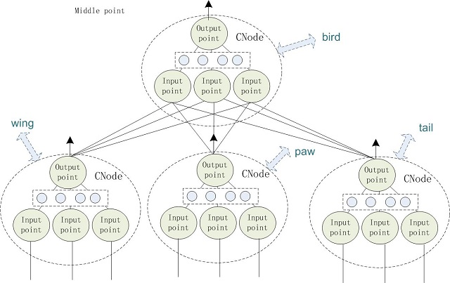
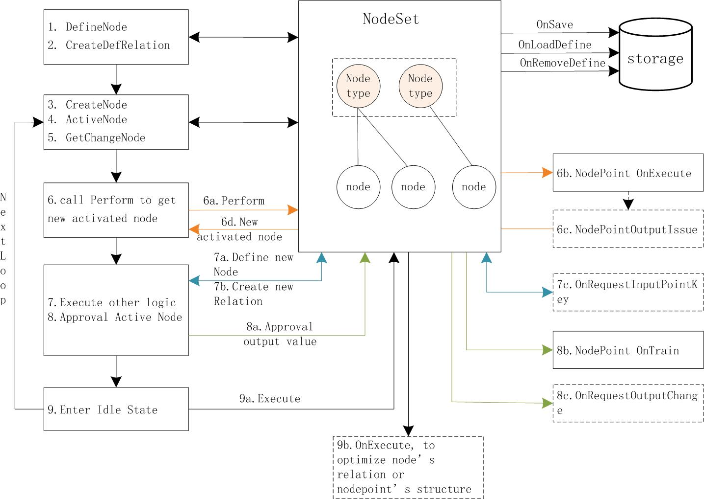
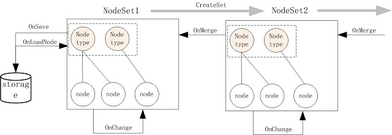
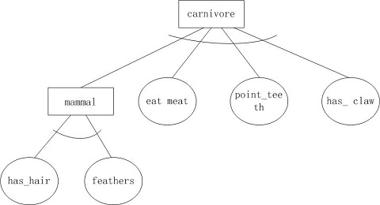

<h1 align="center">Complex Node</h1>

<p  align="center">Flexible relationship and reasoning complex node network</p>



Introduction
----
   
Each node has a specific meaning and can correspond to a data object or process object. The connection between nodes represents the relationship between them. If the status of a node is active, the status of the related node may be active too. In general, there are many factors that cause the state of a node to change. Each factor is associated with multiple other nodes(objects). The structure of the node needs to reflect this case, so a node is not a simple abstract point, but should have relatively complex structure.

Cnode consists of multiple input points and an output point. Each input point is connected to multiple other nodes, which can be regarded as a factor affecting the state of the node. The input point and other nodes are connected through a network. The output point is connected to all input points. The number of input points and connected cnodes can be changed dynamically.

Given status of some nodes, taken these nodes as the input points of other nodes, and get the status of output point of these nodes. A node can correspond to an actual object. When the node is activated, the corresponding object can do some processing. The connections between nodes can be judged based the actual object activation is correct or not.

CNode and pchain can be closely combined, responsible for logic and reasoning. But the application of CNode is not limited to pchain.

CNode features
-----

The actual object can be abstracted as a node, and the relationship between the objects is expressed by the connections between the nodes. CNode has the following features.

* Each node can correspond to an actual object
* Each node is true (activated) can be determined by multiple factors (points), each factor is related to multiple other nodes.
* Each node forms a network through connections and their parameters, supporting inference based on the relationship between nodes.
* Supports dynamic execution(reasoning) to obtain new active nodes
* The execution or inference logic is placed in NodePoint's OnExecute method, which can be flexibly defined, including the use of neural networks algorithm.
* Supports dynamic establishment and optimization of connections between nodes 

CNode Workflow
-----




Basic objects supported by cnode
-----

The cnode implements the following classes:

* [CNodeSetBase](./doc/cnodesetbase.md), which manages and schedule nodes. 
* [CNodeBase](./doc/cnodebase.md). The basis of node, each node including multiple input points and an output point.
* [CNodePointBase](./doc/cnodepoint.md). Manage connections to other nodes or input points

Installation
------

The core of the cnode is developed in C language based on [STARCORE](https://github.com/srplab), and other code is developed in Python language. The core library of starcore has been integrated into the cnode. If you need cle interface and programming related information, please install starcore from the above site.

* **[pip install cnode](#)**

or 

* Clone the cnode locally and run **[python setup.py install](#)**

programming with cnode
------

* cnode initialization

```python
import cnode

Service = cnode.cleinit()
#capture exception
@Service.CNodeSetBase._RegScriptProc_P("OnException")
def CNodeSetBase_OnException(CleObj,AlarmLevel,Info):
  print(Info)

....

cnode.cleterm() 
```

* define NodePoint type

```python
MyPointClass = Service.CNodePointBase('MyPointClass')
@MyPointClass._RegScriptProc_P('OnExecute')
def OnExecute(self,CNodeSet,CNode) :
  node_output = self.GetSourceOutput()
  if len([t for t in node_output if t >= 0.5]) :
    return 1.0
  return 0.0
```

For CNodePoint, OnExecute is used to compute the output of this NodePoint.

**[For input points and output points, the method of calculating the output value is usually different, so at least two types of NodePoints need to be defined](#)**

* define NodeSet type

NodeSet is responsible for managing a group of Nodes, providing Node type definitions, Node creation, Node relationship generation, activating certain Nodes, performing calculations to get more activated Nodes, etc.

```python
MySetClass = Service.CNodeSetBase('MySetClass')
@MySetClass._RegScriptProc_P('OnSaveDefine')
def OnSaveDefine(CleObj) :
  print('save to permanent storage')
    
@MySetClass._RegScriptProc_P('OnLoadDefine')
def OnLoadDefine(CleObj,CNode,Key) :
  print('load node ',Key,' from permanent') 
  return False
  
@MySetClass._RegScriptProc_P('OnRemoveDefine')
def OnRemoveDefine(CleObj,Key) :
  print('remove node ',Key,' from permanent')        
```

For NodeSet, four callback functions need to be defined: OnSave, OnLoadDefine,etc. 'OnSave' is used to store the set to persistent media. 'OnLoadDefine' is used to load a Node from the persistent medium. 'OnRemoveDefine' is used to delete node from persistent medium.

* define Node type, create node and relations

> * create set

```
#create set
set = MySetClass()
```

> * define node type

```python
#node type 1
set.DefineNode('345234535235','',0,OutputPointClass)
set.CreateDefInput('345234535235',InputPointClass, 'in1', 0,False,False);

#node type 2
set.DefineNode('1111111111111111111111','',0,OutputPointClass)  
set.CreateDefInput('1111111111111111111111',InputPointClass, 'in1', 0,False,False);
```

> * create node

```python
node1 = set.CreateNode('345234535235',None)
node2 = set.CreateNode('1111111111111111111111',None)
```

> * create relation

```python
set.CreateRelation(node1,node2,'in1')
```

* Perform calculations

Activate some nodes, perform calculations, and get more active nodes

```python
set.Reset(False)
set.ActiveNode(node1)
Result = set.CreateRunner().Run(0,node1)
print(result)
```

Relationship between NodeSet
------

Multiple NodeSets can be defined, and these NodeSets can be cascaded together. The original NodeSet is responsible for interacting with persistent storage, storing or loading nodes. When a Node is created, the NodeSet obtains the Node type from the previous-level NodeSet, which will eventually result in loading from the persistent storage. A NodeSet can define new Node types. Before the NodeSet is released, the Node types and the relationships between them can be merged into the previous NodeSet and finally stored in the permanent storage.

Use the NodeSet function *[CreateSet](#)* to create the next level Set.



An example of logical reasoning
------



* define NodePoint class

```python
AndLogicClass = Service.CNodePointBase('AndLogicClass')
@AndLogicClass._RegScriptProc_P('OnExecute')
def OnExecute(self,CNodeSet,CNode) :
  node_output = self.GetSourceOutput()
  if len([t for t in node_output if t >= 0.5]) == len(node_output) :
    return 1.0
  return 0.0
```

* define node and relation

```python
#create set
MySetClass = Service.CNodeSetBase('MySetClass')
set = MySetClass()

#define node and relation
set.DefineNode('carnivore','',0,AndLogicClass)
set.DefineNode('mammal','',0,AndLogicClass)  
set.DefineNode('eat_meat','',0,AndLogicClass)
set.DefineNode('point_teeth','',0,AndLogicClass)  
set.DefineNode('has_claw','',0,AndLogicClass)
set.DefineNode('has_hair','',0,AndLogicClass)  
set.DefineNode('feathers','',0,AndLogicClass)  

set.CreateDefInput('carnivore',AndLogicClass, 'ip', 0,False,False);
set.CreateDefInput('mammal',AndLogicClass, 'ip', 0,False,False);
set.CreateDefInput('eat_meat',AndLogicClass, 'ip', 0,False,False);
set.CreateDefInput('point_teeth',AndLogicClass, 'ip', 0,False,False);
set.CreateDefInput('has_claw',AndLogicClass, 'ip', 0,False,False);
set.CreateDefInput('has_hair',AndLogicClass, 'ip', 0,False,False);
set.CreateDefInput('feathers',AndLogicClass, 'ip', 0,False,False); 

set.CreateDefRelation('has_hair','mammal','ip')
set.CreateDefRelation('feathers','mammal','ip')
set.CreateDefRelation('mammal','carnivore','ip')
set.CreateDefRelation('eat_meat','carnivore','ip')
set.CreateDefRelation('point_teeth','carnivore','ip')
set.CreateDefRelation('has_claw','carnivore','ip')
```

* Create node

```python
node1 = set.CreateNode('has_hair',None)
node2 = set.CreateNode('feathers',None)
```

* Perform logical reasoning

```python
set.Reset(False)
node1.SetOutput(1.0)
node2.SetOutput(1.0)
set.ActiveNode(node1)
set.ActiveNode(node2)
set.CreateRunner()
Result = set.Execute()
print('active node is :  ',str(Result))
```

* output result

```sh
('active node is :  ', '[CNodeBase5F2269131751539B[mammal]]')
```

[example code](../example/reasoning_example.py)
